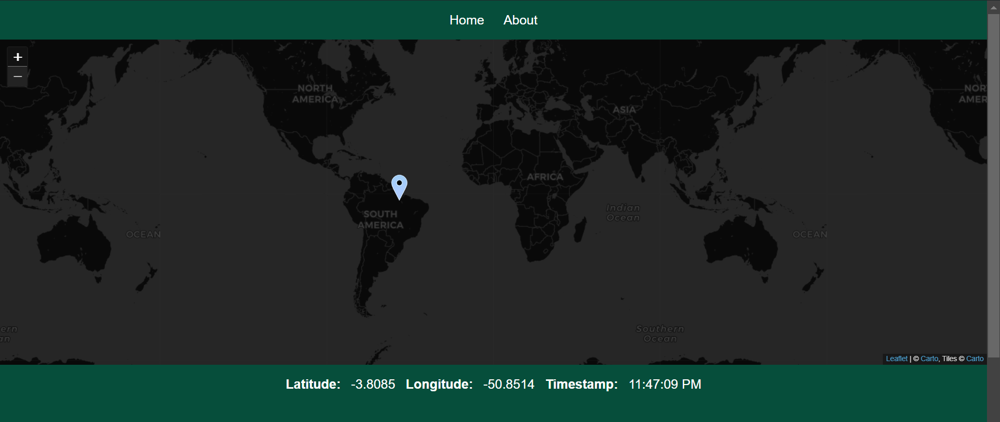

# issdash.net
Welcome! This dynamic website displays the current location of the International Space Station!
# Motivation
While NASA's own view of the current location of the ISS has more sophisticated graphics, I always found it difficult to zoom in. Overall, I believed that the view was not as clear as it could be. This view allows the user to zoom in quite a lot, showing a great deal of context around the location of the ISS. Maybe on a clear night one could see it far overhead using this application!
# Getting Started
This website is currently being hosted on the cloud with a unique URL so getting started is as easy as following the link below!

[Click here](https://www.issdash.net/) to check it out!
# Technologies
This website uses C# in order to create the backend API and serve the static files. The frontend is created with HTML, vanilla JavaScript, and Tailwind CSS. I took building this website as an opportunity to learn the basics of a few technologies that I found interesting; particularly C# and Tailwind CSS. 
